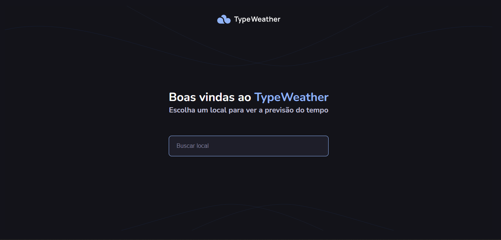
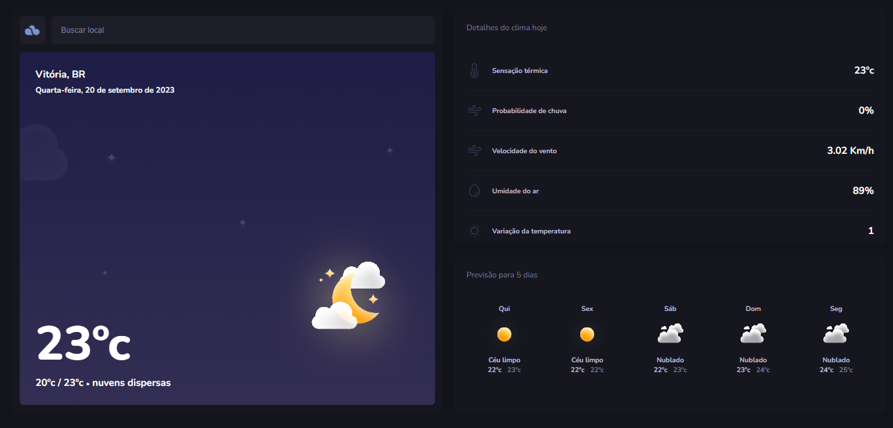

# 📌 Projeto de Previsão do Tempo com TypeScript



## 🚀 Descrição

Este projeto surgiu como uma aula bônus no Explorer da Rocketseat, um renomado curso de programação. Transformamos um projeto originalmente desenvolvido em JavaScript para TypeScript, aprofundando nossa compreensão da linguagem. 

### 🔧 O Desafio

Inicialmente, o projeto estava em JavaScript, e nosso desafio foi migrá-lo completamente para TypeScript.

### 🌦️ Previsão do Tempo

O projeto consiste em uma aplicação de previsão do tempo que utiliza a API da OpenWeatherMap para consultar informações meteorológicas. Fiz umas melhorias no projeto original.

### 📱 Responsividade

Implementei a responsividade para que a aplicação seja adaptável a dispositivos móveis e desktops.

## ⚙️ Instruções de configuração
### Clone o projeto
```
$ git clone https://github.com/Joaov9620/TypeWeather.git
```
### Acesse a pasta do projeto
```
$ cd typeweather
```

### Instale as dependências
```
$ npm install
```

###  Configure as variáveis de ambient
- Crie um arquivo `.env` na raiz do projeto
- Defina as variáveis de ambiente necessárias, use o `.env.example` como base.

## 🔧 Instruções de execução

1.  Execute o servidor: `npm run dev`

2.  Acesse a aplicação em seu navegador com o local host como por exemplo:
` http://127.0.0.1:5173/`

## Deploy 

-🌐 **Deploy do Projeto:** [Link](https://github.com/Joaov9620)